# GetHandy
GetHandy app is an app for finding handyman near you. The application was built as part of the final project of the Mobile Seminar course. The application was built in Android Studio with Kotlin and connected to Firebase for data management.

## Screenshots
### Splash, Login and Sign Up screens
Authentication was performed using firebase authentication and the personal data was saved using firebase firestore.

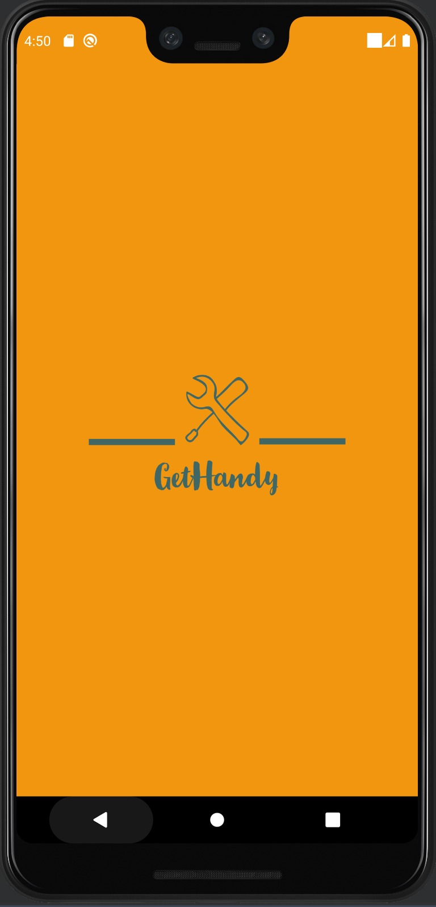 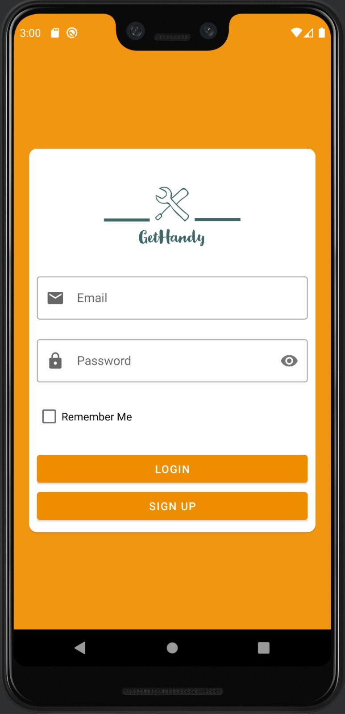 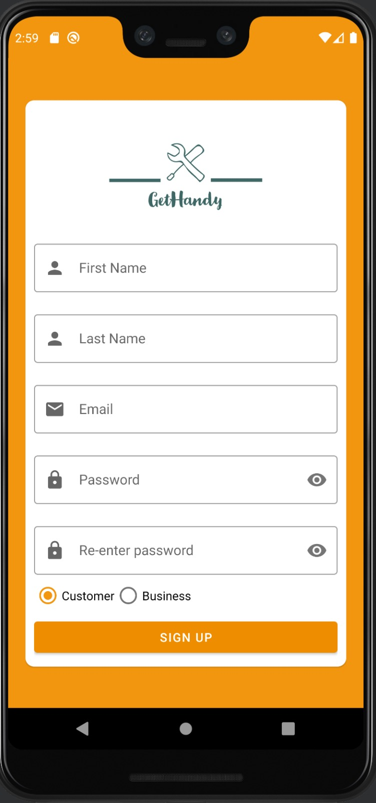

## Customer UI
### Home Screen
A screen that shows all the existing businesses in the system. The businesses are sorted by distance from the user's location and you can search for a business by his name. 

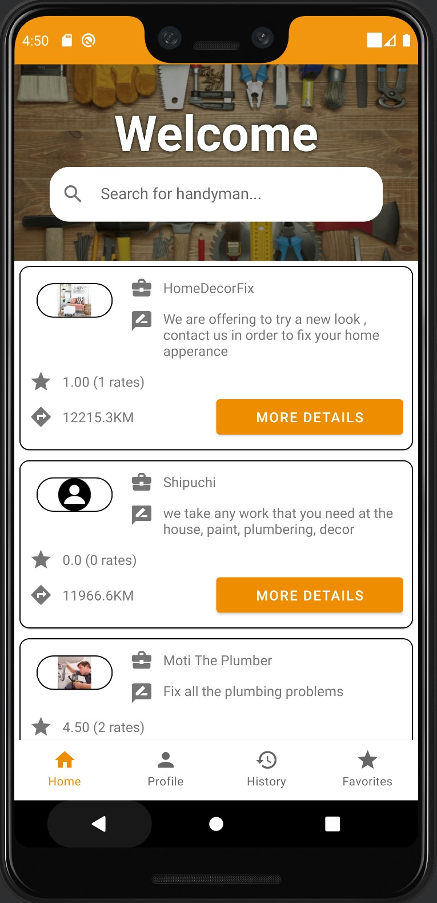

### Business Details Screen
A screen that shows all information about specific business - details, location and reviews.

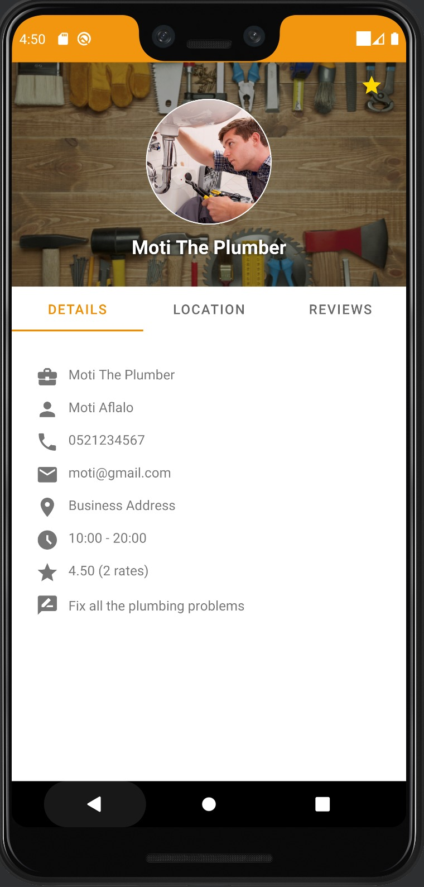 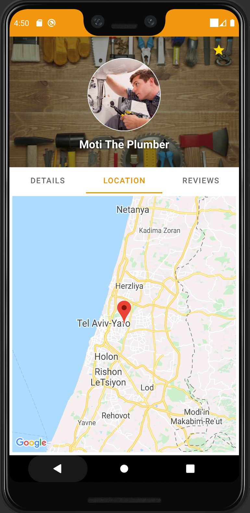 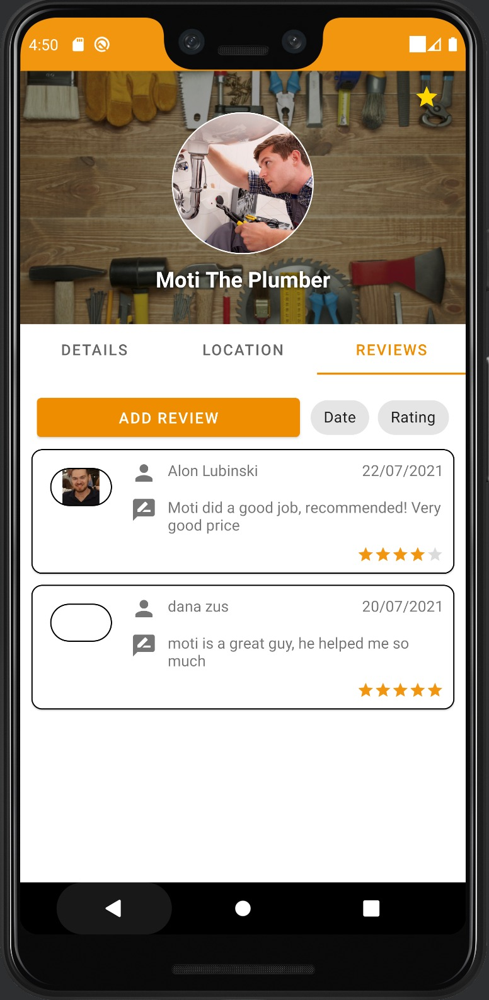

You can add a review and sort all the existing reviews by rating or by date.

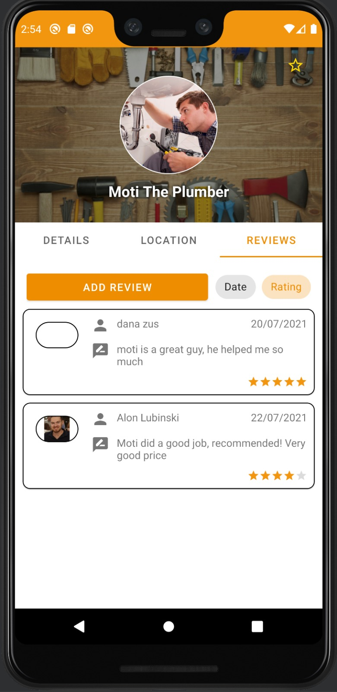 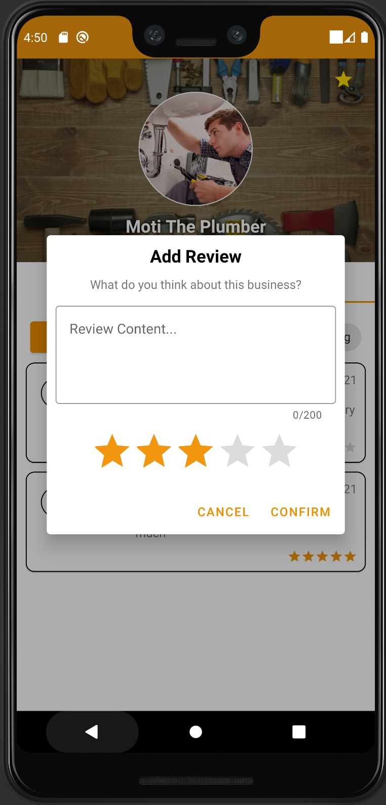

### Profile Screen
A screen that shows the user's information and you can also edit the information.

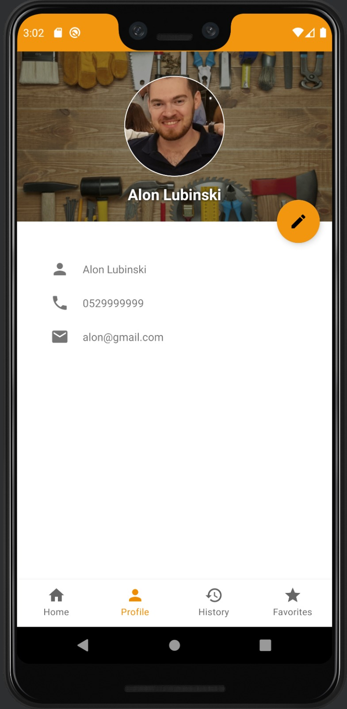 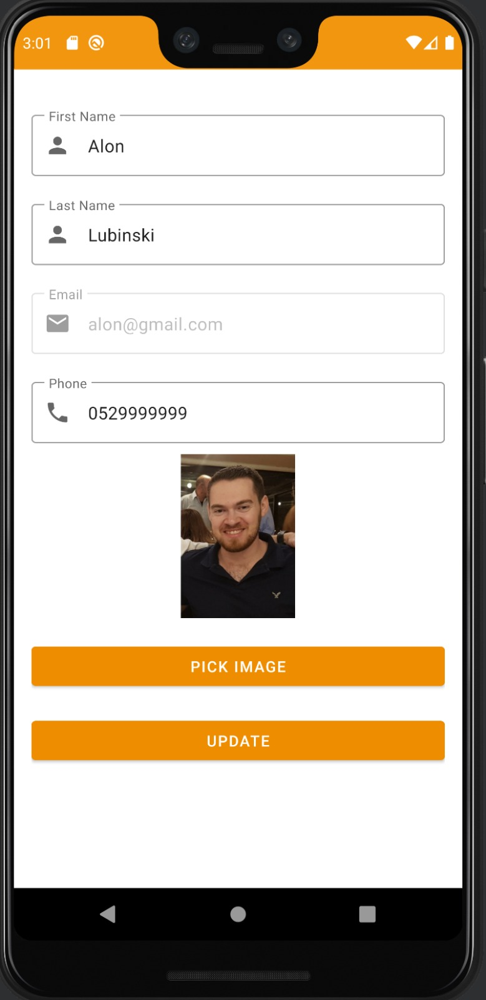

### History Screen
A screen that shows the user's business history.

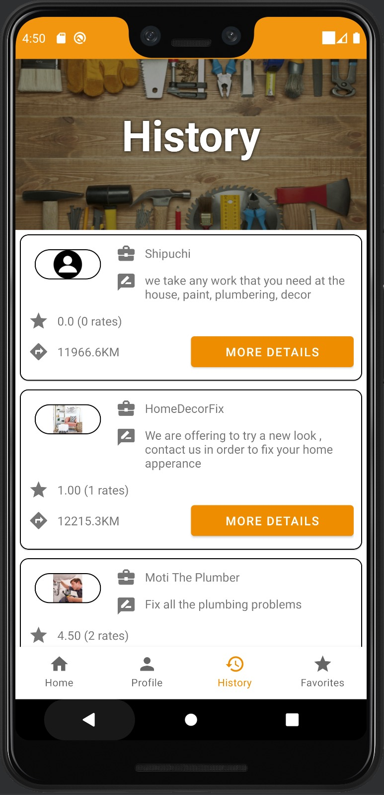

### Favorites Screen
A screen that shows the user's business favorites.

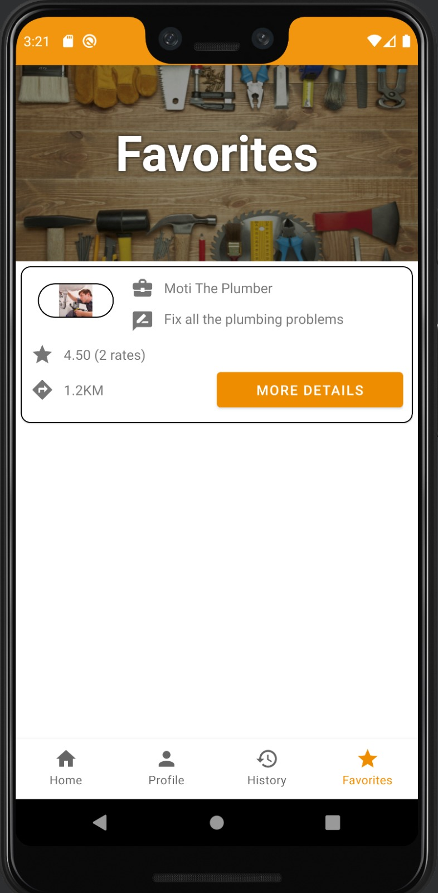

## Business UI
### Business Details Screen
A screen that shows the business details and you can also edit the information.

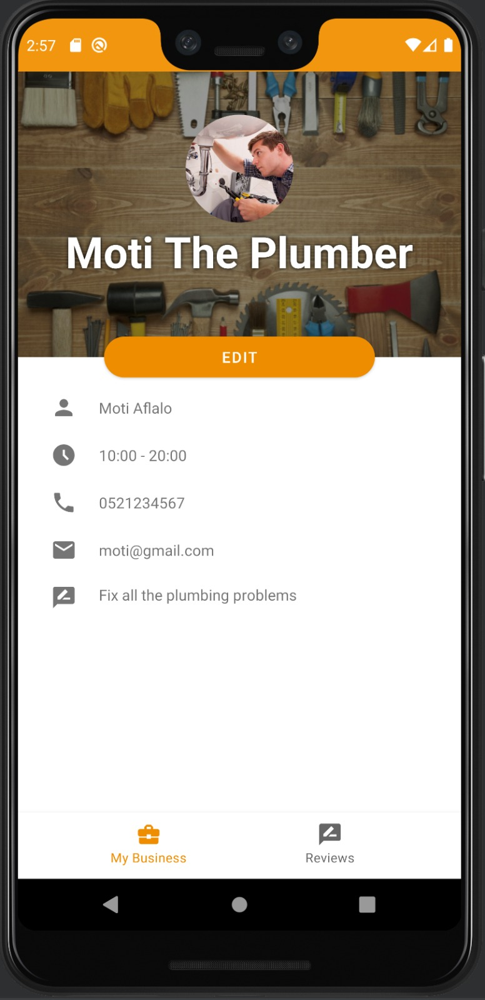 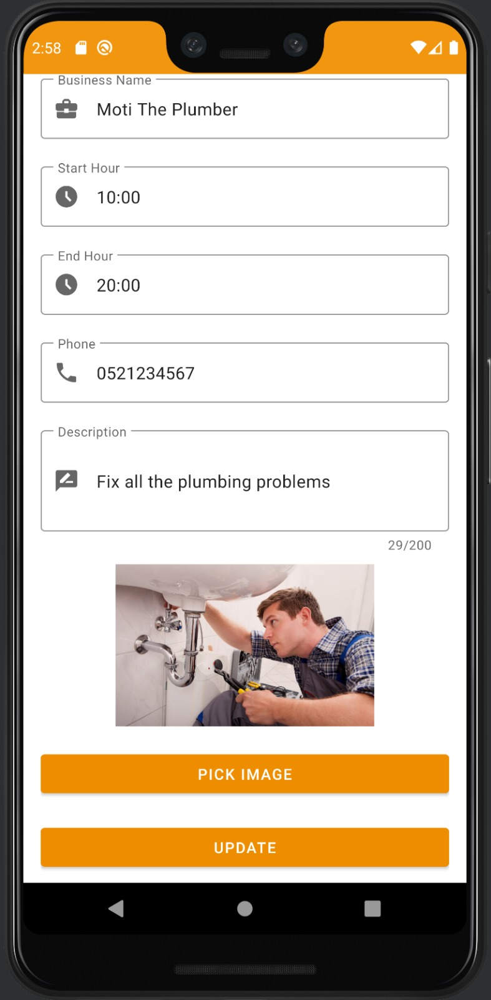

### Reviews Screen
A screen that shows all the business's reviews, and you can also sort all the existing reviews by rating or by date.

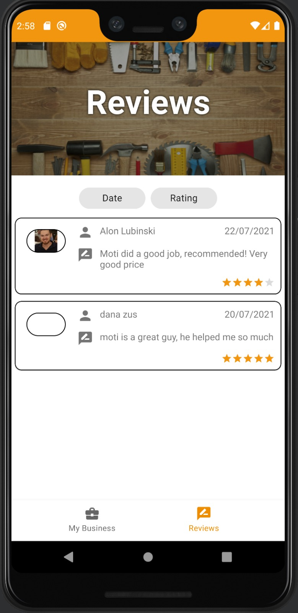
